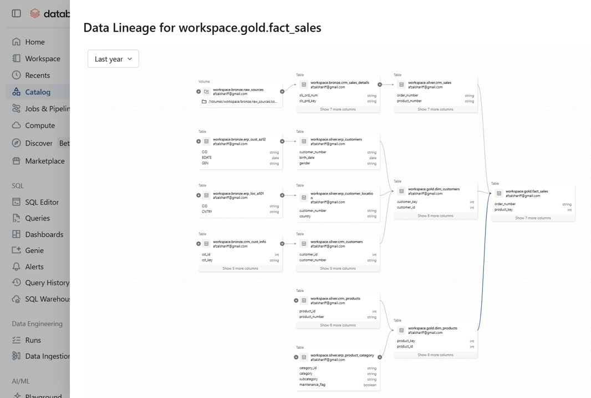
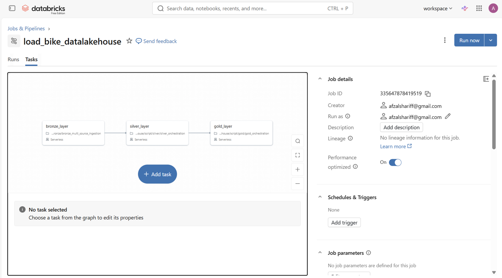

# 🚴 Databricks Bike Sales Lakehouse (End-to-End Data Engineering)

## 🔍 Overview

This repository demonstrates a production-style **Data Lakehouse architecture** implemented on Databricks using the Medallion (Bronze–Silver–Gold) framework.

The project simulates two real-world source systems — a **CRM** and an **ERP** — integrated into a unified analytical model to support Sales and Customer Analytics use cases.

It covers the full data engineering lifecycle:

- Multi-source data ingestion (Bronze)
- Data cleansing, validation & standardization (Silver)
- Dimensional modeling & star schema construction (Gold)
- Notebook orchestration & pipeline automation

> 🔗 **This project is the data engineering predecessor to** [`04-databricks-lakehouse-sales-analytics-bi`](https://github.com/afzalshariff07/04-databricks-lakehouse-sales-analytics-bi) — which builds dashboards and AI analytics on top of the Gold layer produced here.

---

## 🏗️ Architecture — Medallion Pattern

```
CRM Sources          ERP Sources
(cust_info,          (CUST_AZ12,
 prd_info,            LOC_A101,
 sales_details)       PX_CAT_G1V2)
      │                    │
      └──────────┬──────────┘
                 ▼
        🥉 BRONZE LAYER
    Raw ingestion → Delta tables
    (no transformation, full fidelity)
                 │
                 ▼
        🥈 SILVER LAYER
    Cleanse → Validate → Conform
    (type casting, nulls, normalization,
     deduplication, column renaming)
                 │
                 ▼
        🥇 GOLD LAYER
    Star Schema (Fact + Dimensions)
    → dim_customers
    → dim_products
    → fact_sales
```



---

## 📂 Repository Structure

```
03-databricks-bike-sales-lakehouse/
│
├── datasets/
│   ├── source_crm/
│   │   ├── cust_info.csv          # CRM customer profiles
│   │   ├── prd_info.csv           # CRM product master data
│   │   └── sales_details.csv      # CRM transactional sales records
│   │
│   └── source_erp/
│       ├── CUST_AZ12.csv          # ERP customer demographics (birthdate, gender)
│       ├── LOC_A101.csv           # ERP customer location / country
│       └── PX_CAT_G1V2.csv        # ERP product categories & subcategories
│
├── script/
│   ├── init_lakehouse.ipynb                         # Schema & volume setup
│   │
│   ├── bronze/
│   │   └── bronze_multi_source_ingestion.ipynb      # Ingests all 6 CSVs → Delta
│   │
│   ├── silver/
│   │   ├── silver_orchestration.ipynb               # Runs all Silver notebooks in sequence
│   │   ├── crm/
│   │   │   ├── silver_crm_cust_info.ipynb           # Cleans CRM customer data
│   │   │   ├── silver_crm_prd_info.ipynb            # Cleans CRM product data
│   │   │   └── silver_crm_sales_details.ipynb       # Cleans CRM sales transactions
│   │   └── erp/
│   │       ├── silver_erp_customers.ipynb           # Cleans ERP customer demographics
│   │       ├── silver_erp_location.ipynb            # Cleans ERP location data
│   │       └── silver_erp_product_category.ipynb    # Cleans ERP product categories
│   │
│   └── gold/
│       ├── gold_orchestration.ipynb                 # Runs all Gold notebooks in sequence
│       ├── gold_dim_customers.ipynb                 # Builds dim_customers (3-table join)
│       ├── gold_dim_products.ipynb                  # Builds dim_products (2-table join)
│       └── gold_fact_sales.ipynb                    # Builds fact_sales with surrogate keys
│
├── bike-data-lakehouse-end-to-end-lineage.png       # Architecture diagram
├── databricks_jobs_pipeline.png                     # Databricks Jobs pipeline screenshot
├── .gitignore
├── LICENSE
└── README.md
```

---

## 🗂️ Data Dictionary

### Source: CRM

#### `cust_info.csv` → `silver.crm_customers`

| Source Column | Silver Column | Transformation |
|---|---|---|
| `cst_id` | `customer_id` | Null records removed |
| `cst_key` | `customer_number` | Trimmed |
| `cst_firstname` | `first_name` | Trimmed |
| `cst_lastname` | `last_name` | Trimmed |
| `cst_marital_status` | `marital_status` | S→Single, M→Married |
| `cst_gndr` | `gender` | F→Female, M→Male |
| `cst_create_date` | `created_date` | Trimmed |

#### `prd_info.csv` → `silver.crm_products`

| Source Column | Silver Column | Transformation |
|---|---|---|
| `prd_id` | `product_id` | — |
| `prd_key` (first 5 chars) | `category_id` | Parsed & `-` replaced with `_` |
| `prd_key` (remainder) | `product_number` | Parsed |
| `prd_nm` | `product_name` | Trimmed |
| `prd_cost` | `product_cost` | Null → 0 |
| `prd_line` | `product_line` | M→Mountain, R→Road, S→Other Sales, T→Touring |
| `prd_start_dt` | `start_date` | Cast to DateType |
| `prd_end_dt` | `end_date` | — |

#### `sales_details.csv` → `silver.crm_sales`

| Source Column | Silver Column | Transformation |
|---|---|---|
| `sls_ord_num` | `order_number` | Trimmed |
| `sls_prd_key` | `product_number` | Trimmed |
| `sls_cust_id` | `customer_id` | Trimmed |
| `sls_order_dt` | `order_date` | Invalid dates (0 or ≠8 chars) → null, cast yyyyMMdd |
| `sls_ship_dt` | `ship_date` | Same date cleanup |
| `sls_due_dt` | `due_date` | Same date cleanup |
| `sls_sales` | `sales_amount` | — |
| `sls_quantity` | `quantity` | — |
| `sls_price` | `price` | Null/≤0 → derived as sales_amount / quantity |

### Source: ERP

#### `CUST_AZ12.csv` → `silver.erp_customers`

| Source Column | Silver Column | Transformation |
|---|---|---|
| `cid` | `customer_number` | `NAS` prefix stripped |
| `bdate` | `birth_date` | Future dates → null |
| `gen` | `gender` | F/FEMALE→Female, M/MALE→Male |

#### `LOC_A101.csv` → `silver.erp_customer_location`

| Source Column | Silver Column | Transformation |
|---|---|---|
| `cid` | `customer_number` | Hyphens removed |
| `cntry` | `country` | DE→Germany, US/USA→United States, blank→n/a |

#### `PX_CAT_G1V2.csv` → `silver.erp_product_category`

| Source Column | Silver Column | Transformation |
|---|---|---|
| `id` | `category_id` | — |
| `cat` | `category` | Trimmed |
| `subcat` | `subcategory` | Trimmed |
| `maintenance` | `maintenance_flag` | YES→True, NO→False |

### Gold Layer (Star Schema)

#### `gold.dim_customers`
Joined from: `silver.crm_customers` + `silver.erp_customers` + `silver.erp_customer_location`

| Column | Description |
|---|---|
| `customer_key` | Surrogate key (ROW_NUMBER) |
| `customer_id` | Source CRM ID |
| `customer_number` | Business key (used for joins) |
| `first_name`, `last_name` | From CRM |
| `country` | From ERP location |
| `marital_status` | From CRM |
| `gender` | CRM preferred; ERP as fallback |
| `birthdate` | From ERP demographics |
| `create_date` | Account creation date from CRM |

#### `gold.dim_products`
Joined from: `silver.crm_products` + `silver.erp_product_category`

| Column | Description |
|---|---|
| `product_key` | Surrogate key (ROW_NUMBER ordered by start_date) |
| `product_id`, `product_number` | Source identifiers |
| `product_name` | Full product name |
| `category_id`, `category`, `subcategory` | From ERP category table |
| `maintenance_flag` | Boolean from ERP |
| `product_line` | Normalized product line |
| `start_date` | Product availability start |

#### `gold.fact_sales`
Joined from: `silver.crm_sales` + `gold.dim_products` + `gold.dim_customers`

| Column | Description |
|---|---|
| `order_number` | Business order identifier |
| `product_key` | FK → dim_products |
| `customer_key` | FK → dim_customers |
| `order_date`, `ship_date`, `due_date` | Date fields |
| `sales_amount` | Revenue |
| `quantity` | Units sold |
| `price` | Unit price |

---

## ⚙️ Pipeline Orchestration (Databricks Jobs)

The full pipeline is configured as a **Databricks Job** (named `load_bike_datalakehouse`) with tasks running in dependency order:

```
init_lakehouse
      │
      ▼
bronze_multi_source_ingestion
      │
      ▼
silver_orchestration
  (crm_cust_info → crm_prd_info → crm_sales_details
   erp_customers → erp_location → erp_product_category)
      │
      ▼
gold_orchestration
  (gold_dim_customers → gold_dim_products → gold_fact_sales)
```



Each layer is wired as a task dependency, ensuring Bronze completes before Silver runs, and Silver completes before Gold is built. The orchestration notebooks (`silver_orchestration.ipynb`, `gold_orchestration.ipynb`) use `dbutils.notebook.run()` to call child notebooks programmatically, making the Job definition clean and maintainable.

---

## 🔑 Key Engineering Decisions

- **Config-driven Bronze ingestion** — a single notebook ingests all 6 source files via a loop over `INGESTION_CONFIG`, making it easy to add new sources without code duplication.
- **Gender conflict resolution in Gold** — CRM gender is preferred; ERP gender used only as fallback (`CASE WHEN ci.gender <> 'n/a' THEN ci.gender ELSE COALESCE(ca.gender, 'n/a') END`).
- **Price derivation** — missing/invalid prices are reconstructed as `sales_amount / quantity` rather than dropping records.
- **Date validation** — raw integer dates (`yyyyMMdd`) are validated for length and zero-value before casting, preventing silent bad data.
- **Surrogate keys** — Gold dimensions use `ROW_NUMBER() OVER (ORDER BY ...)` for stable, predictable surrogate keys.
- **Orchestration notebooks** — Silver and Gold layers each have an orchestration notebook that calls all child notebooks via `dbutils.notebook.run()`, enabling single-click pipeline execution.

---

## 🛠️ Technologies Used

| Technology | Purpose |
|---|---|
| Databricks | Unified analytics platform |
| Apache Spark / PySpark | Distributed data processing |
| Spark SQL | Gold-layer transformations |
| Delta Lake | ACID-compliant storage format |
| Unity Catalog | Governance & namespace management |
| Medallion Architecture | Layered data design pattern |

---

## 🚀 How to Run

1. **Initialize** — Run `script/init_lakehouse.ipynb` to create Bronze/Silver/Gold schemas and raw volume
2. **Upload source data** — Copy all CSVs from `datasets/` to `/Volumes/workspace/bronze/raw_sources/`
3. **Bronze** — Run `script/bronze/bronze_multi_source_ingestion.ipynb`
4. **Silver** — Run `script/silver/silver_orchestration.ipynb` (orchestrates all 6 Silver notebooks)
5. **Gold** — Run `script/gold/gold_orchestration.ipynb` (orchestrates all 3 Gold notebooks)
6. **Validate** — Query `workspace.gold.fact_sales`, `dim_customers`, `dim_products` to verify outputs

---

## 🔗 Related Project

The Gold layer produced by this project powers:

> **[04 — Databricks Lakehouse Sales Analytics BI](https://github.com/afzalshariff07/04-databricks-lakehouse-sales-analytics-bi)**  
> Dashboards, SQL analytics, and Databricks Genie AI querying built on top of the `gold.*` tables.

---

## 🔗 Future Enhancements

- [ ] Add Bronze → Silver data quality checks (row counts, null rates, schema drift alerts)
- [ ] Implement SCD Type 2 for `dim_customers` and `dim_products`
- [ ] Add Delta Lake optimization (`OPTIMIZE`, `ZORDER`, partitioning)
- [ ] Migrate orchestration to Databricks Workflows (Jobs UI)
- [ ] Add data lineage tracking via Unity Catalog

---

## 🙌 Acknowledgement

This project draws conceptual inspiration from the Databricks Lakehouse Bootcamp by **Baraa Khatib Salkini**.

The architecture, notebook structure, and enhancements in this repository were independently implemented and adapted to simulate enterprise-level data engineering practices.

---

## 👤 Author

**Mohammed Afzal Shariff**  
BI Associate Manager | Data & Analytics Professional  
Bengaluru, India
